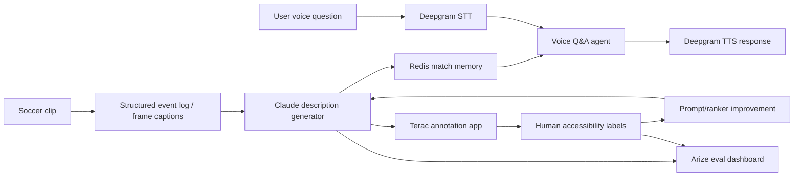

# MatchVision Hackathon Scope

## One-liner

**MatchVision turns live or preselected soccer video into personalized, queryable audio description for blind and low-vision fans, then improves its descriptions using human accessibility labels collected during the hackathon.**

## Tagline

> Commentary tells you the game. MatchVision lets you see it.

## Core problem

Existing soccer commentary is designed for people who can already see the match. It often says things like “great ball in,” “what a chance,” or “he had options,” but blind and low-vision fans still miss the visual layer:

- where the ball is
- direction of attack
- player positioning
- off-ball movement
- why the crowd reacted
- how close a chance was
- what changed in the last few seconds
- whether the user wants brief, tactical, beginner, or emotional detail

**Framing:** MatchVision is not an AI commentator. It is an accessibility-grade visual description layer.

## Grand prize positioning

Submit under **Ddoski’s World**.

Narrative:

> The World Cup is one of the most watched events on Earth, but sports video remains fundamentally visual. MatchVision gives blind and low-vision fans real-time, personalized access to the spatial and tactical context sighted fans take for granted. We prove improvement with human accessibility labels collected during the hackathon.

This hits:

- social impact
- timely World Cup theme
- technical complexity
- creativity
- functionality
- polished user experience

## Sponsor prize strategy

### Primary target: Terac

Terac is the safest sponsor-win path because the rubric is explicit:

- collect real human-labeled data through Terac during the event
- use those labels to improve a model/system
- show the improved system beats the base system on unseen examples
- build a creative annotation environment
- use the human data intelligently within the credit budget

For MatchVision, Terac labels should measure accessibility quality of generated descriptions.

Annotation dimensions:

- Did it describe ball location?
- Did it mention direction of attack?
- Did it capture the key event?
- Was it useful for a blind/low-vision fan?
- Was it concise enough?
- Did it hallucinate?
- Which description is better: baseline or improved?

Before/after metrics to show:

- helpfulness score
- key-event coverage
- spatial detail coverage
- hallucination/error rate
- preference win rate against baseline

Demo metric shape:

- baseline helpfulness: 60-65%
- improved helpfulness: 80-85%
- hallucination rate reduced from ~20% to <10%
- key-event coverage improved from ~55-60% to ~80%

The exact numbers must come from the collected labels/eval, but the demo should clearly show measurable improvement.

### Secondary target: Deepgram

Voice must be essential, not bolted on.

Use Deepgram for:

- speech-to-text user questions
- text-to-speech spoken match descriptions
- voice-first interaction flow

Deepgram pitch:

> For blind and low-vision fans, voice is the interface. MatchVision is not a visual dashboard with voice added. The entire experience is voice-first.

### Secondary target: Anthropic

Use Claude for:

- accessible language generation
- interactive Q&A
- transforming structured match state into vivid audio description
- reducing jargon and hallucinations
- Claude Code for implementation

Anthropic pitch:

> We used Claude to make a mainstream cultural experience accessible to fans excluded by visual-first broadcasts.

### Secondary target: Redis

Use Redis for:

- match event memory
- recent description history
- user preferences: brief, tactical, beginner, emotional
- retrieval over labeled examples or soccer rules

Redis pitch:

> Redis is the real-time memory layer that lets MatchVision answer follow-up questions like “where is the ball now?” or “what changed since the last attack?”

### Secondary target: Arize

Use Arize for:

- traces of generated descriptions
- evals before/after Terac labels
- hallucination/error tracking
- helpfulness metrics

Arize pitch:

> We did not just build a demo. We instrumented whether descriptions actually improved for accessibility.

## MVP scope

Build a reliable demo, not perfect live sports AI.

### Demo input

Use **3-5 preselected soccer clips**. Do not depend on live stream reliability.

Clip types:

1. buildup attack
2. shot/save
3. foul/collision
4. scramble/crowd reaction
5. tactical positioning or counterattack

For each clip, create a structured event log manually or semi-automatically:

```json
{
  "clip_id": "clip_1",
  "time": "00:14",
  "team_in_possession": "blue",
  "direction": "left to right",
  "ball_location": "right wing, 30 yards from goal",
  "event": "winger beats defender and crosses low",
  "players": "two attackers entering box, far-post runner unmarked",
  "crowd_reason": "dangerous chance developing"
}
```

Claude converts this structured state into accessible audio descriptions.

### User voice questions

Support these minimum queries:

- “Where is the ball?”
- “What just happened?”
- “Why did the crowd react?”
- “Who has space?”
- “Describe the last 10 seconds.”
- “Give me tactical detail.”
- “Keep it brief.”

### Example response

> The blue team is attacking from left to right. The ball is near the right sideline, about 30 yards from goal. A winger has beaten one defender and is preparing to cross. Two attackers are entering the penalty box, with one unmarked near the far post.

## System architecture



## Demo script

### 0:00-0:30 Problem

“Commentary exists, but it assumes you can see. Blind and low-vision fans miss spatial context: ball location, direction, off-ball movement, and why the crowd reacts.”

### 0:30-1:30 Live demo

Play a soccer clip silently or with normal commentary.

User asks:

> What just happened?

MatchVision responds:

> The white team won the ball near midfield and quickly switched play to the left. The left winger is sprinting into open space, with one defender trailing. The ball is now near the corner of the penalty box, and a cross is likely.

User asks:

> Why did the crowd react?

MatchVision responds:

> The striker nearly reached the low cross at the six-yard box. He missed by less than a step, which is why the crowd reacted.

### 1:30-2:15 Human improvement

“Using Terac, we collected labels on which descriptions were most useful for blind and low-vision fans.”

Show:

- baseline vs improved description
- helpfulness improved
- hallucination reduced
- key-event coverage improved

### 2:15-3:00 Sponsor/impact close

“Deepgram powers the voice-first experience. Redis stores match memory and user preferences. Arize tracks description quality. Claude generates accessible descriptions. This is World Cup-level access for fans who cannot see the field.”

## What not to build

Avoid:

- full live-stream ingestion
- real-time computer vision from scratch
- offside detection
- generic sports chatbot
- sports news summarizer
- replacing commentators
- overclaiming perfect accessibility

## Must-have deliverables by judging

- working web demo
- 3-5 soccer clips or simulated clips
- structured event logs for clips
- Deepgram STT for user questions
- Deepgram TTS for spoken responses
- Claude-generated accessible descriptions
- Redis memory / preferences
- Terac annotation flow
- before/after eval metrics from labels
- Arize traces/eval dashboard
- GitHub repo
- README explaining sponsor usage
- 2-3 sentence Devpost pitch
- 3-minute demo video

## Devpost pitch draft

**MatchVision is a voice-first accessibility companion that gives blind and low-vision soccer fans the missing visual layer of a match: ball location, player positioning, direction of attack, and why key moments matter. Built for the World Cup era, it uses Deepgram for voice interaction, Claude for accessible descriptions, Redis for match memory, Terac for human accessibility labels, and Arize to prove our descriptions improve over a baseline.**

## Closing line

> We are not replacing commentators. We are adding the missing visual layer, personalized and voice-first, for fans who have been excluded from the world’s most visual sport.
