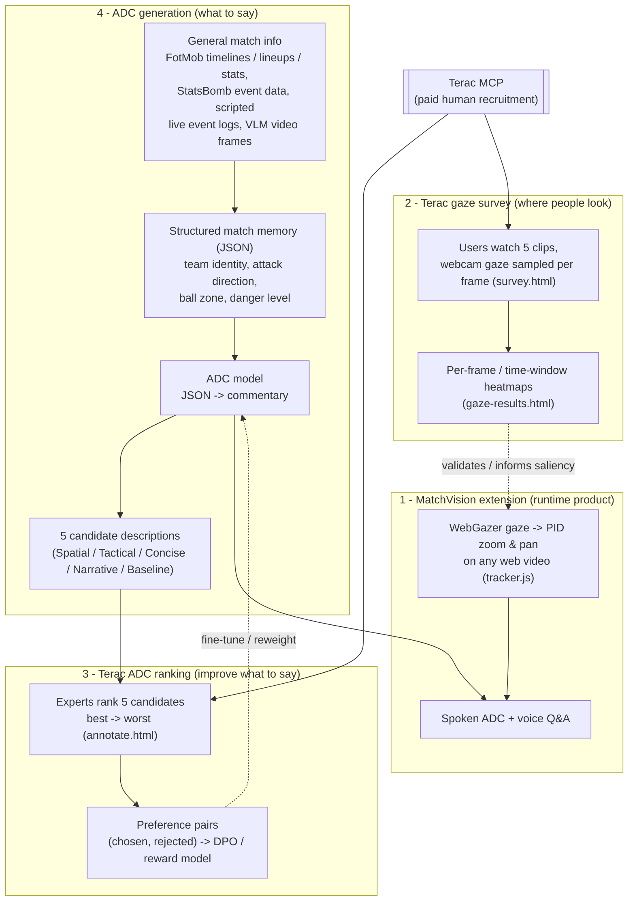

# MatchVision — Systems Overview

MatchVision is an accessibility layer for soccer that makes the **visual** parts of a
match available to blind and low-vision fans. It is made of four cooperating systems:

| # | System | One-liner | Who it serves |
|---|--------|-----------|---------------|
| 1 | **MatchVision extension** | Chrome extension: webcam eye tracking that zooms & pans any web video to where you look, plus spoken commentary/Q&A | Low-vision fans (runtime product) |
| 2 | **Terac gaze survey** | Paid Terac task that collects real users' gaze on soccer clips → per-frame attention heatmaps | Research / the eye-tracking model |
| 3 | **Terac ADC ranking** | Paid Terac task where experts rank candidate audio descriptions → human preference data | Improving the ADC model |
| 4 | **ADC generation** | Turns general match info (FotMob-style timelines, event data, video frames) into structured match state, then writes audio-descriptive commentary | Blind fans (the words we speak) |

> **ADC** = *audio-descriptive commentary* — short, factual, spatially-explicit
> narration of a soccer moment for someone who cannot fully see the screen
> (e.g. *"Seattle is attacking left to right; the ball is on the right wing near
> the box, two attackers central, four defenders between ball and goal."*).

Two ingredients are shared by everything: **WebGazer** webcam eye tracking (used by
both system 1 and system 2) and **Terac MCP** (used to recruit paid humans for both
system 2 and system 3).

---

## How they tie together

**The loops, in words:**

- **System 4 feeds System 3.** ADC generation produces the candidate descriptions
  that experts rank. Ranking only makes sense because there are real candidates to
  compare.
- **System 3 feeds back into System 4.** The expert rankings become a preference
  dataset used to fine-tune / reweight the ADC model so it leans toward accessible
  style (spatial clarity, direction of attack, conciseness, factual grounding). This
  is the core "model improvement" story for the Terac track.
- **System 2 supports System 1.** The gaze survey measures where humans actually look
  during a match. That validates the eye-tracking product and provides a "human
  attention prior" the zoom engine (and, conceptually, the ADC) can use to decide
  *which region matters*.
- **System 1 is the runtime product.** The extension is where a low-vision user
  actually benefits: gaze-driven zoom **plus** spoken ADC/Q&A. It consumes the
  improved ADC model (3 + 4) and embodies the eye tracking that system 2 studies.

---

## 1. MatchVision extension — eye-tracked zoom & pan

**What it is:** a Manifest V3 Chrome extension ("MatchVision Eye Tracker") that runs on
any website with a `<video>` (YouTube, broadcasters, etc.). It uses the webcam to
estimate where you are looking and **zooms in and pans the video to follow your gaze**,
so a low-vision user can keep the action large and centered. It also offers spoken
commentary and voice Q&A about the moment.

**Where it lives:**
- `extension/manifest.json` — MV3 manifest; content script injected on `<all_urls>`.
- `extension/tracker.js` — the content script: finds the best video, runs the gaze
  loop, and a **PID controller** smoothly drives zoom (`zoomLevel ≈ 2.0`) and pan so
  the picture isn't jittery.
- `extension/models/*`, `extension/mediapipe/*`, `webgazer.min.js` — bundled
  WebGazer / MediaPipe FaceMesh assets so **face processing stays on-device** (no
  video of the user leaves the browser).
- `extension/panel.js`, `extension/offscreen.html`, `src/services/voice.js` — voice
  ADC / Q&A (rolling conversation context sent to the LLM).

**How it works:** webcam frame → WebGazer gaze estimate → exponential smoothing →
PID error vs. the video center → bounded zoom/pan transform on the video element.

**Why it matters:** this is the product low-vision fans actually use. There is also a
browser-only demo of the same idea (`eyetrack-webgazer.html`, `src/services/eyetrack-*`)
for showing the technique without installing the extension.

---

## 2. Terac gaze survey — per-frame attention heatmaps

**What it is:** a remote study, launched as a **paid Terac task**, that recruits real
people to watch five short soccer clips while their webcam records *where on each
frame* they look. Aggregated, this produces heatmaps of where fans naturally attend.

**Where it lives:**
- `survey.html` + `src/survey.js` — the participant flow: consent → 9-point WebGazer
  calibration → watch 5 clips → gaze sampled continuously. Each sample is
  `{ t, vt, x, y, sx, sy }` (clip time, video time, normalized + screen coords).
- `data/survey_clips.json`, `clips/survey/*.mp4` — the clip catalogue + media.
- `api/gaze.js` (prod, Upstash/Redis) and the `/api/gaze` handler in `local-server.mjs`
  (dev, files under `data/gaze/`) — store one session per submission.
- `scripts/terac-agent.mjs --survey` (`npm run terac:survey`) — creates and launches
  the Terac opportunity: an **activity** task, `device_types: ['desktop']`, with a
  webcam-consent screener so only webcam-capable desktop users qualify.
- `gaze-results.html` + `src/gaze-results.js` — aggregates all sessions into per-clip
  heatmaps, including a **time-synced overlay** that plays the heatmap over the video
  (Live window / Cumulative / Aggregate modes). Reading gaze data is gated by a
  `GAZE_ADMIN_TOKEN` (participant data is not public).

**Why it matters:** it turns "where do fans look?" into data. That's both a validation
of the eye-tracking premise behind system 1 and a reusable **saliency signal** —
the busiest gaze region in a frame is a strong candidate for what to zoom toward and
what the ADC should describe first.

---

## 3. Terac ADC ranking — human preference data for the model

**What it is:** the **model-improvement** loop. For each soccer moment we generate five
candidate descriptions; Terac-recruited experts **rank them best→worst** and tag why.
Those rankings become preference pairs used to train/tune the ADC model.

**Where it lives:**
- `annotate.html` + `src/annotate.js` — the ranking UI shown to raters.
- `data/annotation_tasks.json` — the tasks: each has a clip, a `clip_summary`, and the
  5 `candidates` (produced by system 4).
- `scripts/terac-agent.mjs` (default "commentary" mode, `npm run terac`) — launches the
  ranking opportunity on Terac with a soccer/accessibility screener; embedded
  calibration items gate rater quality.
- `/api/labels` (Upstash in prod, `data/labels.local.json` in dev) — stores each
  ranking; `/api/sessions` tracks rater calibration/quality.
- `scripts/build-preference-dataset.mjs` (`npm run build-pairs`) — expands every
  5-item ranking into `5·4/2 = 10` ordered `(chosen, rejected)` pairs, **keeping only
  qualified raters**, and writes `data/training/preference_pairs.jsonl` for DPO /
  reward-model training.
- `src/ranker.js` — a lightweight, interpretable feature scorer (weights for
  ball location, direction, key event, conciseness, minus hallucination risk);
  `scripts/evaluate-ranker.mjs`, `src/eval.js` / `eval.html`,
  `scripts/export-dpo-dataset.mjs` support evaluation and export.

**Why it matters:** a generic LLM can describe a clip, but not in a consistent,
accessibility-first style. Human rankings teach the model *which* description is most
useful to someone who can't see the match — improving the **content** of system 4
without touching the vision model.

---

## 4. ADC generation — match info → structured state → commentary

**What it is:** the pipeline that produces the actual words. Its key design decision is
to **separate visual understanding from commentary**: extract a structured JSON match
state first, then generate commentary from that JSON (never raw video → words
directly). This isolates "did the *commentary model* get better?" from "did the *vision*
get better?".

**Inputs ("general match info"):**
- **FotMob-style match metadata** — timelines, lineups, score, stats (the kind of
  general feed the user references).
- **StatsBomb open event data** via `analytics/statsbomb_pipeline.py`
  (kloppy + socceraction → SPADL/VAEP) for ground-truth event/positional context.
- **Scripted live event logs** — e.g. `data/sample_event_logs.json` for demo/live mode.
- **VLM frame extraction** — Qwen-VL / Gemini reading sampled video frames for visual
  cues when only video is available.

**Where it lives:**
- `src/services/match-context.js` + `src/services/match-memory.js` — deterministic team
  identity, half-aware attack direction, and a **rolling structured match memory**.
  ADC and Q&A read from this JSON, never from raw pixels.
- `src/services/description.js` — ADC + Q&A generation; the LLM provider (Qwen/DashScope,
  Anthropic, or Gemini) is routed by `/api/describe` and `/api/context`
  (`local-server.mjs` / `api/`).
- `scripts/generate-candidates.mjs` (`npm run generate`) — **the bridge to system 3**:
  extracts frames, has the VLM write a `clip_summary`, then generates the five candidate
  descriptions using distinct strategies (Spatial, Tactical, Concise live, Narrative,
  Baseline) with strict anti-hallucination rules. These candidates land in
  `data/annotation_tasks.json` for ranking.
- `scripts/optimize-prompt.mjs` — distills winning labels into a "champion" system
  prompt used at runtime.
- Speech is handled by Deepgram / browser TTS (`src/services/voice.js`).

**Why it matters:** this is the half of the product blind fans hear. Structured state
makes the commentary reliable and auditable, and makes the improvement in system 3
measurable (same JSON in, base vs. fine-tuned output).

---

## Where to look first

| You want to… | Start here |
|---|---|
| Try the runtime zoom product | `extension/` (load unpacked) or `eyetrack-webgazer.html` |
| Run the gaze survey locally | `survey.html` via `./run.sh`, results at `gaze-results.html` |
| Launch a paid gaze study | `npm run terac:survey` (`scripts/terac-agent.mjs --survey`) |
| Launch a paid ranking study | `npm run terac` (`scripts/terac-agent.mjs`) |
| Generate ADC candidates | `npm run generate` (`scripts/generate-candidates.mjs`) |
| Build the training dataset | `npm run build-pairs` (`scripts/build-preference-dataset.mjs`) |
| Read the deeper model/fine-tuning rationale | `matchvision_adc_terac_architecture.md` |
